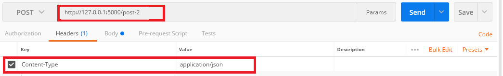

# To run this project
## step 1:

Run with anaconda

```bash
python ./api_simple/main.py
```
## step 2:

Use postman to test API
### POINT 1 
Type api url and header like in picture 


Send request


### POINT 2
Type api url and header like in picture 



Send request


[Provided by HienTX](https://www.linkedin.com/in/hientx/)
